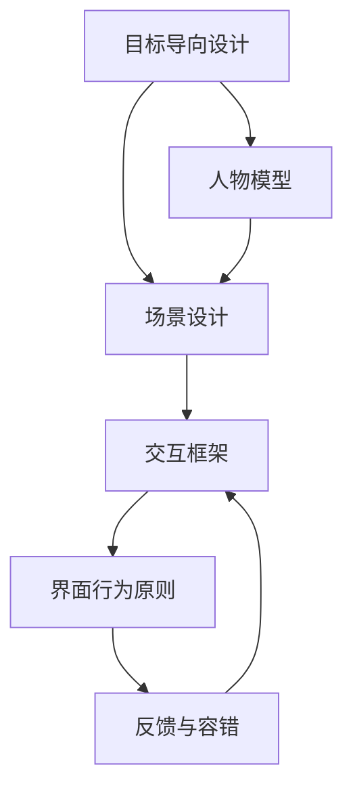

# INDEX — 《交互设计精髓》337 复习 Skill 地图

## 推荐复习顺序

1. [目标导向设计](goal-directed-design/SKILL.md)
2. [人物模型](persona-modeling/SKILL.md)
3. [场景设计](scenario-design/SKILL.md)
4. [交互框架](interaction-framework/SKILL.md)
5. [界面行为原则](interface-behavior-principles/SKILL.md)
6. [反馈与容错](feedback-and-error-handling/SKILL.md)

## 关系图

## 337 答题调用表

| 题型 | 优先调用 |
|---|---|
| 名词解释 | 人物模型、场景、心智模型、认知摩擦、反馈 |
| 简答题 | 目标导向设计流程、Persona 作用、场景设计步骤 |
| 论述题 | 目标导向设计 + 交互框架 + 界面原则 |
| 案例分析题 | 场景设计 + 反馈容错 + 心智模型 |
| 工业设计综合题 | 目标导向设计 + 智能产品/服务系统迁移 |
